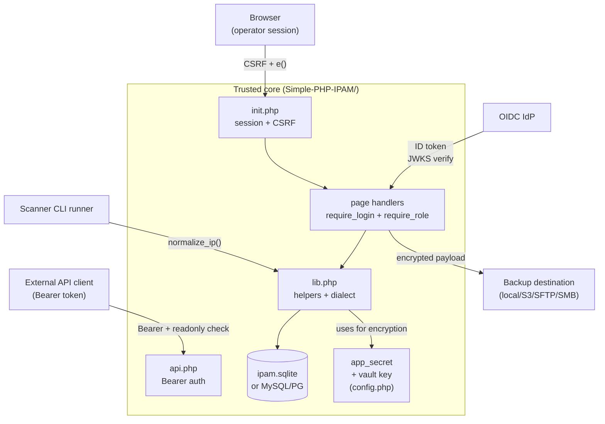

# Security model

> **Audience:** security reviewer, architect, or agent assessing the system's defensive posture. Threat model, trust boundaries, and explicit non-threats. Implementation details (how OIDC works, what `ipam_sudo_verify()` does) live in `auth-model.md`. Operator-facing guidance (deployment hardening, TLS, reverse-proxy headers) lives in `docs/security.md`.

---

## What we defend

A self-hosted PHP web app that records IP addressing, subnetting, VLANs, sites, and operator-attached metadata. The data is operator-sensitive (network topology, asset ownership) but not regulated-class secrets in itself. The threat model is "small/medium org running their internal IPAM on a server they own".

### Assets

1. The IPAM database (`addresses`, `subnets`, `vrfs`, `vlans`, `sites`, `contacts`, `tags`, custom fields, history).
2. Operator credentials — `users.password_hash` (bcrypt), TOTP secrets (encrypted), WebAuthn credentials, API key hashes.
3. Backup payloads — IPAMBKL1 dumps and IPAMBKP3 encrypted archives, including encrypted backup-destination credentials.
4. `app_secret` — the single root key from `config.php`. Protects TOTP secrets, encrypted destination credentials, encrypted-with-`app_secret` backups (IPAMBKP2). Per-tenant keys (v4 forward) HKDF-derive from it.
5. Audit log — tamper-evident operator activity.

### Adversaries we model

| Adversary | Capability | Defence |
|---|---|---|
| Unauthenticated network attacker | Can reach the app over HTTPS | Login required, rate-limited; CSRF on every POST; HTTPS-only cookie + HSTS; reCAPTCHA v3 on login |
| Authenticated readonly user | Has a valid session, `role=readonly` | `require_write_access()` 403s every write; UI hides write affordances |
| Authenticated admin (legitimate) | Has a valid session, `role=admin` | Step-up auth gates sudo-class actions; audit log records every state change; self-protection guards prevent self-lockout |
| Compromised admin session (XSS or stolen cookie) | Operates as an admin until session expires | Idle-timeout; `SameSite=Strict`; sudo-class actions require fresh proof regardless of session age; `app_secret` not reachable from DB |
| Operator with DB-file access (read) | Can read `data/ipam.sqlite` directly | TOTP secrets and destination creds encrypted with `app_secret` (not in DB); bcrypt password hashes; audit log integrity not protected against full-DB tampering — this is an out-of-scope assumption |
| Operator with backup access | Can read tarballs / S3 objects | IPAMBKP3 backups encrypted with the vault key (separate from `app_secret`); IPAMBKP2 with `app_secret`; restore requires the key |
| Misconfigured IdP / network MITM | Can forge or intercept OIDC tokens | OIDC ID token signature verified against cached JWKS; nonce + state; PKCE on the auth code exchange; OIDC discovery cached with cache-bust on signature failure |
| Scanner-input attacker | Submits crafted IP/host through the scanner UI | All scanner inputs pass `normalize_ip()` before `proc_open`/`fsockopen` (invariant #19); Semgrep rule `ipam-proc-open-safe` enforces; `scan_run.php` is CLI-only (invariant #18) |

---

## Trust boundaries

Every arrow into the trusted core has a named validator at the boundary. The validators are documented in `coding-guide.md` → "Validation patterns".

### User-preference endpoint (`user_preference.php`)

The per-user preference store (`user_preferences` table) crosses the
browser → core boundary through a **dedicated session-authed endpoint**, not
through `api.php`. The boundary contract (ADR-002):

- **Session-authed, not Bearer.** `user_preference.php` requires `init.php` and
  a logged-in session (`is_logged_in()` → 401 otherwise). It is deliberately
  **not** a resource in `api.php` — the Bearer/CSRF-exempt API surface must not
  expose per-user, cookie-scoped state.
- **CSRF-protected.** Every POST calls `csrf_require()` before any write,
  exactly like a normal browser POST handler.
- **No admin gate.** A preference is the user's own non-privileged choice;
  there is intentionally no `require_role('admin')`. The user mutates only
  their own row (keyed by `current_user()['id']`).
- **Server-side key allowlist.** Writes are constrained to
  `IPAM_PREF_ALLOWLIST` — a request for any key outside the allowlist is
  rejected with 400. A user cannot create arbitrary key/value rows.
- **Per-key value validation.** Each allowlisted key has its own `case` arm
  that validates the value (e.g. `theme` must be `light|dark|auto`); an invalid
  value is a 400. Adding a key means adding both an allowlist entry and a
  validating `case`.

---

## Authentication layers

The system maintains three independent authentication concepts, in increasing strength:

1. **Session.** Established at login; idle-timeout via `require_login()`; cookie is `Secure`, `HttpOnly`, `SameSite=Strict`; session name namespaced per install so multiple instances on the same domain don't collide.
2. **Login MFA (optional).** TOTP / Email OTP / WebAuthn, per-user enrolment + per-install policy. Verified once at sign-in.
3. **Step-up (sudo).** Fresh proof of identity at the moment of a sensitive action — independent of how the user originally logged in. Necessary because OIDC-only admins have no local password and no login MFA, yet must still pass a strong gate before vault reveal, DB import, API key creation, etc.

Sudo-class actions (full list in `auth-model.md` → Step-up):

- Vault key reveal
- Sensitive setting reveal
- DB import / restore
- API key creation
- MFA disable
- Step-up policy save

All three layers are decoupled. A session does not imply login-MFA passed; login-MFA does not imply sudo grant.

---

## Authorisation

Two roles: `admin` and `readonly`. No RBAC / fine-grained scopes in v3.x. The v4.x roadmap (`v4-release-stream.md`) introduces RBAC; not in force today.

`require_login()` enforces session presence + idle timeout.
`require_role('admin')` enforces role on top.
`require_write_access()` 403s if the user is readonly, regardless of method.

API keys carry an `is_readonly` flag. Readonly keys 403 on every write endpoint. Endpoint-level enforcement is in each handler's case in `api.php`; the contract is in `api-contract.md`.

---

## Self-protection guards

The four `users.php` actions that can lock the system out are blocked both server-side and in the UI when the target is the logged-in user's own account:

- `toggle_active` (disable/enable)
- `set_role`
- `unlink_oidc`
- `delete`

The **last-active-admin guard** counts active admins **excluding the target** (`AND id != :id`) and fires only when the target is active AND admin. An inactive admin can be deleted freely.

Apply the same pattern if you add a new admin-on-admin action. The pattern lives in `users.php`; copy it explicitly rather than abstracting — the guard's specificity is its value.

---

## CSRF

Every browser POST handler calls `csrf_require()` at handler-top. Every form includes the token in a hidden field. The token is per-session; rotated on `session_regenerate_id()` after login.

`api.php` is the only browser-facing surface exempt from CSRF — it is stateless, authenticated per-request via Bearer token. Do not turn on cookies for `api.php`.

---

## Output encoding

Every HTML output goes through `e()`. The function is registered as the Semgrep XSS sanitiser in `.semgrep/rules.yml` (rule `ipam-xss-unsanitized-echo`). There is no second sanitiser; do not introduce one.

JSON output uses `json_encode($payload, JSON_THROW_ON_ERROR | JSON_UNESCAPED_SLASHES)` via `api_json_response()`.

---

## Redirect safety

Open redirects are a defence-in-depth concern, especially on auth flows where the operator may follow a callback URL post-login. The `validate_return_path()` helper rejects:

- Absolute URLs (`http://`, `https://`)
- Protocol-relative URLs (`//attacker.com`)
- Backslash-prefixed (`\\attacker.com` — browsers normalise `\` to `/`)
- Anything not starting with `/`

The Bug Z arc (v3.27.0) showed what happens when two validators with overlapping responsibilities exist and diverge. **Rule:** when CodeRabbit or a security review tightens a validator, the same PR adds a test asserting existing valid use cases still pass. Where overlapping validators exist, rationalise to a single shared helper.

---

## Cryptography

| Use | Algorithm | Key source |
|---|---|---|
| Password hashing | bcrypt (`password_hash(PASSWORD_DEFAULT)`) | — |
| Session cookie | PHP session; opaque random ID | — |
| API key | SHA-256 over a 32-byte URL-safe random | `random_bytes()` |
| TOTP shared secret | RFC 6238 | Generated by `robthree/twofactorauth` |
| TOTP secret-at-rest | AES-256-GCM via `ipam_totp_encrypt_secret()` | `app_secret` |
| Backup destination credentials | AES-256-GCM | `app_secret` |
| IPAMBKP2 backup payload | AES-256-GCM (legacy) | `app_secret` |
| IPAMBKP3 backup payload | AES-256-GCM | Vault key (separate, operator-rotatable) |
| OIDC ID token verify | RS256 / RS384 / RS512 | IdP's JWKS, cached 1h |
| Per-tenant keys (v4.0.0+) | HKDF-SHA256 derived from `app_secret` | — |

**`app_secret` lives in `config.php`, never in the DB** (invariant #12). Storing the root key inside the data it protects defeats the model. The vault key is similarly held in `config.php` (or operator-typed during sensitive operations), not stored alongside encrypted backups.

The hand-rolled OIDC verifier (RS256/384/512 from JWK n/e to PEM, no ext-gmp, no JWT library) was a deliberate choice — see `runtime-dependency-policy.md` → "Explicitly not adopted". Revisit if a security-sensitive bug surfaces or if RFC-tracking burden becomes obviously not worth it.

---

## Rate limiting

| Surface | Bucket | Window | Action |
|---|---|---|---|
| Login | per-IP `login_attempts` rows | 15 min | Soft-fail with backoff message after N failures |
| Step-up proof submit | per-IP `sudo` bucket via `record_auth_failure()` | minutes | Refuse subsequent proofs from the same IP for the cap window; `auth.sudo_rate_limited` audit row |
| OIDC callback | implicit via state + nonce | per-request | Reject replay |

Login `login_attempts` is purged lazily on bootstrap and explicitly during test cleanup.

---

## Audit log

Append-only by trigger (invariant #5). Every state-changing action emits one row. The full action vocabulary is in `audit-actions.md`.

The log is the primary forensic record. It is **not** cryptographically tamper-evident — an attacker with DB write access can rewrite history if they disable the trigger first. This is documented as an out-of-scope assumption ("operator with full DB write access" is outside the model). For deployments that need tamper-evident logging, the recommendation is to ship the audit feed to an external SIEM.

---

## Backup encryption

Three creator-side states:

- **Unencrypted** — IPAMBKL1 logical dump or engine-native dump, no encryption applied. Operator opt-in.
- **Stored** — IPAMBKP2 (legacy, `app_secret`-keyed) or IPAMBKP3 (vault-keyed). Encrypted at backup time, key persisted to `config.php`. This is the default for new installs.
- **Transitory (restore-only in v3.28.0)** — IPAMBKP3 archive encrypted with an operator-supplied passphrase, accepted by the restore wizard. Write path is parked — see `parked-features.md`.

Vault key vs `app_secret`:

- `app_secret` protects DB-internal sensitive values (TOTP secrets, destination creds). It is shared infrastructure — rotating it invalidates every encrypted value.
- Vault key protects IPAMBKP3 backup payloads. It is operator-rotatable; rotating it invalidates only existing IPAMBKP3 backups (which become unrestorable until the rotation includes a re-encrypt step).

This separation lets operators rotate backup keys without rotating all in-DB secrets, and lets the system encrypt new secrets with `app_secret` while a vault key is being rotated.

---

## Non-threats (explicit, with rationale)

| Non-threat | Rationale |
|---|---|
| Operator with root on the server | Out of scope by definition. The model defends the application; not the host. |
| Operator with full DB write access | Same — audit-log triggers can be disabled by anyone with DDL. |
| Side-channel timing attacks on bcrypt / `password_verify` | `password_verify` is constant-time; out-of-scope precision. |
| Quantum-capable adversary | Out-of-scope for a self-hosted IPAM in 2026. |
| Supply-chain attack on Composer packages | Tracked but not actively defended beyond version-pinning + curated whitelist. Mitigation by minimisation — only 4 runtime deps. |
| Browser plugin or local-machine attacker | Out of scope; we trust the operator's browser session. |
| Plaintext network MITM | HTTPS is enforced (redirect at `init.php`); operating over HTTP is operator misconfiguration. |
| DOM-based XSS from vendored frontend assets | Vendored assets are vanilla, ≤50KB, no third-party CDN at runtime; carve-out policy in `runtime-dependency-policy.md`. |

---

## Recurring patterns that bit us

These are the security-shaped lessons distilled from `lessons-learned.md`. Read the original entries for full context.

- **Validator-tightening without regression coverage.** When you tighten a guard, the same PR must include a test pinning every existing valid use case. (Bug Z arc.)
- **Sentinel values must be enforced at every writer.** When a model assumes `password_hash='!disabled'` for OIDC-only users, audit every code path that creates such a user. (Bug U arc.)
- **Function defined ≠ function called.** Repo-wide grep for callers of every new helper. Zero callers means the feature isn't wired. (Bug X arc.)
- **Documented invalidation events ≠ wired invalidation events.** When a doc lists 11 events that invalidate a sudo grant, a contract test must assert all 11 have call sites. (Bug T arc.)
- **Backslash bypasses path validators.** `\\attacker.com` works as an open-redirect vector if the validator only checks `//`. (v3.15.1 stash sanitiser.)

---

## Cross-references

- `design-document.md` → invariants — the load-bearing rules enforced at code locations.
- `auth-model.md` — auth implementation reference (helpers, OIDC, MFA, step-up).
- `coding-guide.md` → "Validation patterns" — the boundary validators.
- `audit-actions.md` — full audit vocabulary.
- `runtime-dependency-policy.md` → "Explicitly not adopted" — why hand-rolled OIDC.
- `docs/security.md` — operator-facing deployment guidance.
- `lessons-learned.md` §5 — chronological auth/security lessons.

---

## Update protocol

- New adversary class identified → add to the "Adversaries we model" table or to "Non-threats" with rationale.
- New asset type added (e.g. a new encrypted column) → add to "Assets" and "Cryptography" with the algorithm and key source.
- Trust boundary changed (new external integration, new validator) → update the mermaid diagram and the boundary description in `design-document.md` together.
- Security-shaped pattern surfaces in a regression → add it under "Recurring patterns that bit us" and link to the lessons-learned entry.
